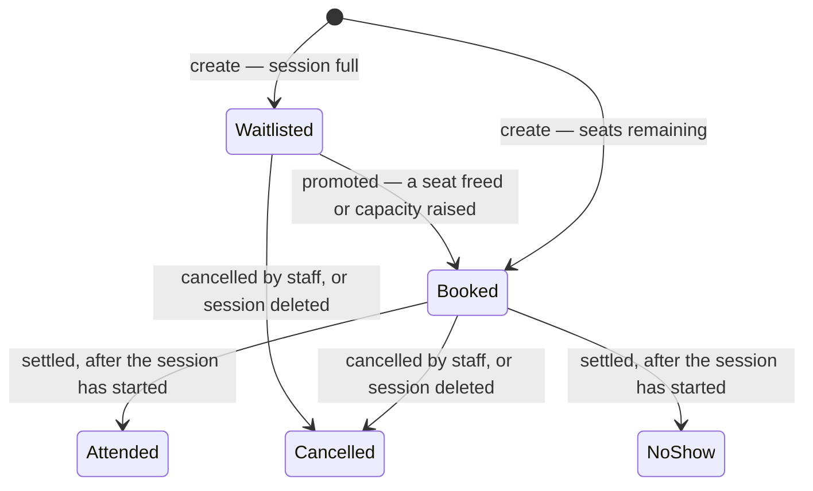

# Architecture

The four questions below are the ones this document has to answer.

- What are the moving pieces, and how do they talk to each other?
- Where does each piece run?
- What is the request path for one representative user action, end to end?
- What did you decide *not* to build, and why?

| Question | Section |
|---|---|
| The moving pieces, and how they talk | §2, §3 |
| Where each piece runs | §6 |
| One request, end to end | §7 |
| What I decided not to build | §8 |

This document describes the **shape** of the system. Where a choice needed arguing, the argument is in
`decisions.md`; table-level detail is in `schema.md`. I have kept those out of here on purpose.

---

## 1. The system in one page

A back-office tool for a single fitness studio. Staff manage classes, sessions, members and bookings.
Instructors see only the sessions they teach and record who turned up.

Most of it is CRUD. **The difficulty is concentrated in one place:** a booking decides between Booked and
Waitlisted against a capacity another request may be changing at the same instant; cancelling one promotes
the next eligible person off the waitlist in the same breath; and every move leaves a record nobody can
later edit. The schema, the locking protocol and the transaction boundaries are all shaped by that
sentence.

Two facts about the users drive as much of the design as any technical constraint. **A member is a
customer record first and an account only if the desk says so** — most never sign in, and bookings are
taken for them at the front desk. There is still no real-time layer (§8), because self-service books
directly to Booked or Waitlisted exactly as staff do: no deliberation window, and nothing that needs one
person's screen to change because of another's action. And **the roles must be separated on the server**,
which goal 1 states explicitly, so §4 has three enforcement mechanisms rather than one — a rule that had
to be revisited in eighteen places when a third role arrived (Decision 3).

```
                    ┌──────────────────────────────────────────┐
   browser ────────▶│  Render Static Site  (owns the origin)   │
                    │   /        → React SPA bundle            │
                    │   /api/*   → rewrite to the API ─────────┼───┐
                    └──────────────────────────────────────────┘   │ HTTPS
                                                                   ▼
                                                       ┌──────────────────────┐
                                                       │  FastAPI  (Uvicorn)  │
                                                       └──────────┬───────────┘
                                                                  │ asyncpg / TLS
                                            transaction pooler    │ (Supavisor :6543)
                                                                  ▼
                                                       ┌──────────────────────┐
                                                       │  PostgreSQL          │
                                                       │  (Supabase)          │
                                                       └──────────────────────┘
                                                                  ▲  session pooler :5432
                                                       Alembic ───┘  (DDL-safe)
```

Three deployable pieces and one build-time piece. Deliberately small: every extra runtime component is
another thing that can fail on a free tier.

---

## 2. The pieces

| Piece | What it is | Key constraint |
|---|---|---|
| **React SPA** | Static bundle, no server. Vite 6 + React 19 + TS strict. TanStack Query owns all server state; eight runtime dependencies | Its route guard is cosmetic — every rule is re-enforced server-side |
| **FastAPI API** | All business logic, async end to end | One Uvicorn worker on 0.1 CPU; `pool_size=5, max_overflow=5` |
| **PostgreSQL** | Source of truth, and **not passive** — constraints and triggers enforce the invariants, and it is also the concurrency-control mechanism | Reached through a transaction pooler (§3) |
| **Alembic** | Five migrations, run by hand from a workstation (§6) | Session-mode pooler, psycopg 3 — asyncpg refuses multi-statement DDL. Never autogenerated: a third of the schema is hand-written SQL the ORM cannot express, and autogenerate would drop it |

### How they talk

**Browser → API: REST/JSON under `/api/v1`, same-origin.** The static site owns the origin and rewrites
`/api/*` to the API rather than using two hostnames. That is the most consequential line in the diagram:
`onrender.com` is on the Public Suffix List, so two Render hostnames are different *sites*, the refresh
cookie would be third-party, and Safari would log a reviewer out on every reload. One origin also removes
CORS from the system entirely.

Two consequences: every request now arrives from Render's proxy, so anything reasoning about the client
address parses `X-Forwarded-For`; and a CDN proxy caps upstream time, so a 30–60 s cold start makes the
keep-warm job load-bearing rather than a nicety.

**API → Postgres: asyncpg through Supavisor in transaction mode.** You borrow a real connection for the
length of a transaction, then it goes back. Four consequences, each of which is a bug if ignored:

- **Two** prepared-statement caches must be disabled — asyncpg's and SQLAlchemy's. Disabling one fails
  intermittently under load and never locally.
- **`SET LOCAL`, never `SET`** — a bare `SET` persists on a connection the pooler hands to someone else.
- **Session-scoped advisory locks are unusable**; the pooler returns the connection while the lock is
  held. This is the mechanical reason the system locks real rows. Transaction-scoped ones are safe.
- **`LISTEN`/`NOTIFY` does not work**, which forecloses Postgres's own pub/sub.

---

## 3. Code structure

**The layering rule:** routers do HTTP, services do domain logic and own the transaction, repositories do
queries, models do persistence. A router never opens a transaction or holds a business rule; a service
never knows it is being called over HTTP.

```
backend/app/
  main.py            app factory, lifespan, middleware, exception handlers, routers
  core/              config · deps · errors · security · time · logging · rate_limit
  db/                engine (pooler compatibility) · transaction (SET LOCAL, the row lock)
                     base (declarative base + constraint naming) · columns
  models/            ten tables across seven files, + enums
  schemas/           Pydantic request/response models, separate from the ORM
  api/v1/routers/    auth · classes · sessions · bookings · members · users
                     rooms · dashboard · alerts · exports · health
                     public_schedule (no auth) · operations (stretch)
                     me (+ me_rendering)  the member's own surface (stretch)
  services/          booking_service     the state machine, capacity, promotion
                     session_service     scheduling, co-instructors, batched counts
                     recurrence_service  bulk generation, advisory lock, savepoints
                     auth_service        login, rotation, reuse detection
                     alert_service · export_service · class/member/user_service
                     term_booking_service  a term of bookings, a savepoint per session
                     booking_events.py   the single function that appends to the timeline
  repositories/      visibility      the instructor scoping rule, as composable SQL
                     booking_search  goal 6's filters, sorts, paging, queue position
                     dashboard       goal 8, as one statement
                     operations      room use and instructor pay (stretch)
  seed/              the demo studio, built by driving the real services
backend/alembic/     five migrations, beginning with the tables and then the guarantees
backend/tests/       415 tests
```

```
frontend/src/
  api/               fetch client, token store, request/response types — knows no React
  hooks/             query keys, cache invalidation, the form hook — knows no markup
  components/ui/     neutral primitives: button, field, table, dialog, toast
  components/domain/ the studio's vocabulary: occupancy marks, chips, rosters, pickers
  routes/            ten screens, one file each (+ landing/)
  lib/               pure functions: dates, occupancy, validation rules, paths
  styles/            design tokens — every utility compiles to var(--color-*)
```

**Three seams built for the self-service phase**, each defensible on its own terms today: `BookingService`
is the only place a booking's status changes; `record_event` is the only path into the audit log; and
`members` is its own table with no auth columns, so it grows them later without `bookings.member_id`
moving.

**Screens map to goals** — Today (8, 10), Timetable (3, 5, 7), Bookings (4, 6), Members (1, 10), Classes
(2), Session detail (3, 4, 5, 7), Booking history (9), Reports (7, 8, plus the two operational reports),
Sign-in (1), and People — who can sign in, and what each is paid. Members have a side of their own
under `/my`: what is on, and what they have booked (Decision 5). Two pages need no account at all: the
landing page and the public timetable at `/schedule`. One build for every role: the server scopes what an
instructor sees, and a second set of routes would be a second place to get that wrong.

---

## 4. Security model

**Authentication.** A 15-minute JWT held in memory only — never `localStorage`, so an XSS bug cannot
exfiltrate a long-lived credential. The refresh token is an **opaque** random string (its job is to be
revoked, which a JWT cannot be), stored only as a SHA-256 hash, delivered as an httpOnly `SameSite=Lax`
first-party cookie. Every refresh rotates and revokes its predecessor; presenting an already-rotated token
revokes the whole family.

Three supporting details: the client refreshes **single-flight**, or five parallel 401s would revoke the
family and log the user out; the server accepts a token rotated in the last 10 seconds, which is a bounded
hole in reuse detection and is listed in §10; and argon2 runs in a threadpool, because 100–500 ms of CPU
inside an `async def` freezes every other in-flight request.

**Authorization — three mechanisms, because three kinds of check are genuinely different.**

1. **Route-level role checks.** `require_role("staff")` on every staff-only endpoint.
2. **Row-level read visibility — a query filter, not a post-fetch check.** One
   `visible_sessions_clause(user)` is composed into every session and booking query. An instructor cannot
   read somebody else's booking because the SQL never selects the row, not because a handler remembered to
   look. A forgotten check leaks silently; a forgotten filter shows obviously wrong rows. Filtering after
   fetching also cannot work for counts at all. The member directory is scoped by a clause **derived from**
   that one, so the roster and the directory can never disagree about who exists.
3. **Row-level write authorization**, checked **inside the transaction after the session row is locked** —
   a dependency-level check could be raced by a co-instructor being removed between check and write.

| Action | Staff | Instructor | Member |
|---|---|---|---|
| Create / edit / archive classes, sessions, members; add people; manage co-instructors | ✔ | ✘ | ✘ |
| Create or cancel a booking | ✔ (any session) | ✘ | ✔ — their own only |
| Settle as Attended / Absent, add a note | ✔ | ✔ (own sessions only) | ✘ |
| View sessions and their bookings | all | own sessions only | ✘ — own bookings only |
| Read the member directory | all | only members booked onto a session they can see | ✘ — themselves only |
| Export attendance CSV | ✔ | ✔ (own sessions only) | ✘ |
| Membership alerts and dismissal | ✔ | ✘ | ✘ |
| Book a whole term for one member | ✔ | ✘ | ✘ |
| Room utilisation | ✔ | ✘ — a commercial figure about the studio | ✘ |
| Instructor pay | ✔ — everyone | ✔ — their own row only | ✘ |
| Dashboard | full | scoped to their own sessions | ✘ |
| Switch on a member's login | ✔ | ✘ | ✘ — there is no sign-up |

**A member is not an instructor with fewer ticks.** Every column above was written when there were two
roles, as `if staff … else instructor`; the third made eighteen of those `else` branches reachable by
somebody they were not written for. They fail closed — a member matches no instructor row, so filters
return nothing and guards return 403 — but "an empty page" is the wrong answer to give a customer, so
each was decided rather than left. Decision 3.

**Error model.** Services raise typed domain exceptions; one handler set maps them to HTTP, and Postgres
integrity errors are mapped **by constraint name** so they never escape as a 500.

| Source | HTTP |
|---|---|
| `NotFound` / `PermissionDenied` / `AuthenticationFailed` | 404 / 403 / 401 |
| `RuleViolation`, `IllegalTransition` | 422 — well-formed request, illegal for this state |
| `Conflict`, `one_active_booking`, the overlap constraints | 409 |
| `LockTimeout`, deadlock | 503 + `Retry-After` — the server was briefly unable, not the client excessive |

The client shows **the server's sentence**, with no translation table — "Cannot cancel a booking that is
already Attended." was written to be read by a person. Three codes get behaviour instead: 401 triggers the
refresh and one retry, 409 on a `version` reloads the record, 503 retries after the stated delay.

---

## 5. The booking lifecycle



`Cancelled`, `Attended` and `NoShow` are terminal. Promotion is **never a direct action** — only ever a
consequence of a cancellation or a capacity increase — so it cannot be used to bypass capacity. Every move
not drawn is rejected with a sentence explaining why, which is goal 4's actual requirement; the full
rejection table is in `schema.md`.

Two interpretations rather than transcriptions, flagged as such: cancellation is staff-only, and a booking
cannot be created on a session that has already started.

**The concurrency protocol.** Capacity is per-session, so the session row is the concurrency boundary.
Every operation that can change a session's Booked count begins with:

```sql
SELECT * FROM sessions WHERE id = :session_id FOR UPDATE;
```

Same session serialises; different sessions are fully parallel. Isolation is `READ COMMITTED` with explicit
locking rather than `SERIALIZABLE`, which would turn last-seat contention into retry loops that degrade
worst when the system is busiest. Four operations take the lock — create, cancel, settle, capacity edit —
and all four take the session row **before** any booking row, which is what makes them mutually
deadlock-free. `lock_timeout` is 3 s, so contention returns a clean retryable 503 rather than pinning a
worker.

**Promotion** takes waitlisted bookings in `booked_at, id` order and promotes the first whose membership has
not expired — re-checked at promotion, because goal 4 blocks an expired member from *getting* a booking and
promoting one would be the same outcome by a side door. An expired member is skipped and left in the queue,
with a `note_added` event recording it.

**The ceiling, stated rather than waved at.** The cancel-and-promote transaction is eight statements, so at
~1 ms RTT the lock is held ~8–10 ms: **roughly 100 bookings/sec on a single session**, with `lock_timeout`
rejecting contenders about 300 deep. Sessions are independent, so this is per-session. That is far beyond a
front desk. The escalation path, in order, is: collapse the transaction into one CTE (3×, no new
component) → an unlocked fast path for the obviously-full case → a `holds` table in Postgres → only then
Redis. Note that the **connection pool binds before the lock does**, which is why Redis would not remove the
real wall. Decision 2 has the full comparison.

**The recurring generator** (goal 7) has three non-obvious problems, solved as follows: concurrent
generators race on the GiST exclusion constraint with no natural lock ordering, so the batch takes a
transaction-scoped advisory lock; partial success is impossible with plain inserts because one violation
aborts the transaction, so each candidate goes in a `SAVEPOINT`; and savepoints are capped at 200
candidates because Postgres caches only 64 subtransaction ids per backend. Weekly recurrence also iterates
**local dates**, not UTC — adding seven days to a `timestamptz` drifts an hour across a DST boundary.

**Data freshness.** No real-time transport, so staleness is a decision: a 20-second `staleTime` with refetch
on window focus, longer where data does not move, nothing polling, and every mutation invalidating the
queries it affected. The worst case is a colleague seeing a count 20 seconds stale — and if they act on it
the server rejects the illegal move, because **the correctness guarantee never depended on the screen being
fresh.**

---

## 6. Runtime and deployment

| Piece | Runs on | Free-tier caveat |
|---|---|---|
| React SPA | Render Static Site (CDN) | Needs `/* → /index.html`, or every deep link 404s on refresh |
| FastAPI API | Render Web Service | One worker. **Sleeps after ~15 min idle** |
| PostgreSQL | Supabase | Small connection budget. **Pauses after ~1 week**, manual unpause |
| Alembic | Run by hand from a workstation | Session pooler, `postgres` role |
| Seed | One-off command, same connection | So the live URL shows a working studio, not an empty shell |
| Keep-warm monitor | UptimeRobot, `/health/ready` every 5 min | **Built** |
| CI, error tracking | GitHub Actions, Sentry | *Not built — §10* |

**This is deployed and running.** Supabase `ap-south-1` on **PostgreSQL 17.6**, a Render Web Service for
the API and a Render Static Site for the SPA, seeded with 112 sessions, roughly 1,300 bookings and 2,300 audit
events. What follows is what deploying it actually taught, rather than what I expected it to.

**Regions are pinned, and getting that wrong was the single largest performance defect in the project.**
The booking transaction makes several round trips while holding a row lock, so a mismatched pair multiplies
lock hold time by an order of magnitude. The first deployment put the API in **US West** against a database
in **Mumbai** — roughly 230ms per round trip — and every page took three to four seconds. Moving the service
next to the database cut `/public/schedule` from 6.5s to 1.6s and `/health/ready` from 2.4s to under 0.9s.
Nothing about the code changed. This paragraph was already in this document before any of it happened, which
is the uncomfortable part: knowing a rule is not the same as checking you followed it.

**Two health endpoints, and the monitor uses the right one.** `/health` is liveness with no database access;
`/health/ready` runs `SELECT 1`. The monitor must hit the second, because a request that never touches
Postgres keeps Render awake and does nothing about Supabase's pause timer.

An UptimeRobot check hits `/health/ready` every five minutes — one monitor covering both timers, at an
interval that survives a single missed check rather than only a perfect run.

**Deploy.** `git push` → build → `exec gunicorn …` → health check → traffic switches, in about 60 seconds.

**Migrations are run by hand, and that is a change from the plan.** This document used to say they ran as
the first command of container start-up, because the free tier has no release-command hook. Deploying it
showed that to be the worse option: at start-up a failed migration turns into a crash loop on wake, with no
previous instance to fall back on and a paused database able to cause it. Running `alembic upgrade head`
from a workstation against the session pooler makes the failure land in a terminal where somebody is
watching, changes nothing about the running service, and keeps DDL on the owner role and the session pooler
where it belongs. The cost is a manual step in the release, which is the right trade for one instance and
an audience of one operator. Migrations stay expand-then-contract regardless, so old code tolerates the new
schema between the two.

**The order matters and I got it wrong once.** Applying a schema change before deploying the code that
understands it left a window where the database refused duplicate class titles while the running app had no
translation for the constraint and returned a 500. Code first, then schema, or the two disagree in public.

**Configuration** arrives as environment variables through `pydantic-settings`, which fails at start-up if
one is missing — a missing secret should crash the deploy, not surface as a 500 an hour later. The one worth
naming is `STUDIO_TIMEZONE`: four goals produce *wrong numbers* rather than errors if it silently defaults
to UTC, so it is required and validated against the IANA database. There is no `CORS_ALLOWED_ORIGINS`,
because the same-origin rewrite removes the question.

**Platform claims, verified by running them** rather than reasoned about. Confirmed on PG 18.6 locally, and
every one of them again on **Supabase's PostgreSQL 17.6** when the migrations ran there unchanged:
`timestamptz + interval` is rejected in a generated column (so `ends_at` is trigger-maintained); partial
GiST exclusion on `(uuid =, tstzrange &&)` works with `btree_gist`; a deferred constraint trigger accepts a
`WHEN` clause and can take a row lock; `BEFORE TRUNCATE` closes the hole a row trigger leaves. **One claim
was corrected by measurement:** a trigram index on `citext` creates happily and is then never used — the
`::text` cast has to be in the query.

**The four claims that said "to confirm at deploy" are now confirmed.** The same-origin rewrite keeps the
refresh cookie first-party — proven by rotating a session through the static host using only the cookie.
`citext`, `btree_gist` and `pg_trgm` are all creatable by Supabase's `postgres` role. The transaction pooler
works with asyncpg once both prepared-statement caches are off and statement names are unique. And the
version gap turned out to be one major rather than several: local 18.6, Supabase **17.6**, with nothing in
these migrations needing anything newer — the one PG18-era feature that might have crept in, a generated
`ends_at` column, had already been rejected for an unrelated reason.

**One claim did not survive.** "The round trips are dominated by the query" was never written down, but it
was what I assumed. Measured against Supabase, a trivial request spent 100ms on its query and 475ms on
overhead — connection validation and two `SET LOCAL` statements — paid identically whether the endpoint
returned 193 bytes or a full dashboard. §10 records what was done about it.

---

## 7. One request, end to end

**Staff cancel a Booked booking on a full session that has a waitlist** — the densest path in the system.

```mermaid
sequenceDiagram
    participant B as Browser (SPA)
    participant R as Static-site proxy
    participant A as FastAPI worker
    participant S as BookingService
    participant P as PostgreSQL

    B->>R: POST /api/v1/bookings/{id}/cancel (Bearer token, {note})
    R->>A: forwarded, X-Forwarded-For set
    A->>A: request-id middleware
    A->>A: get_current_user — verify JWT, load user, check is_active
    A->>A: require_role("staff")
    A->>S: cancel(booking_id, actor, note)
    S->>P: BEGIN; SET LOCAL lock_timeout='3s'
    S->>P: SELECT session... FOR UPDATE (peers on this session now queue)
    S->>P: SELECT booking... FOR UPDATE
    S->>S: state machine guard — status in (booked, waitlisted)?
    S->>P: UPDATE booking -> cancelled + INSERT booking_events
    S->>P: SELECT waitlisted ORDER BY booked_at, id — first eligible member
    S->>P: UPDATE that booking -> booked + INSERT booking_events (is_system)
    S->>P: COMMIT (deferred capacity trigger re-locks and validates here)
    S-->>A: BookingCancelled + WaitlistPromoted
    A-->>B: 200 {booking, promoted_booking}
    B->>B: invalidate bookings / session / dashboard queries -> refetch
```

Four things the diagram does not say:

- **The booking is re-read under the lock.** It may have changed between the first read and acquiring it.
- **The promotion is in the same transaction, not a follow-up.** A seat can never be freed without the
  waitlist being considered, because no code path does one without the other.
- **The deferred capacity trigger takes the session lock itself at commit.** A plain deferred `count(*)`
  would not be race-safe and would read like a guarantee while being none — `schema.md` has that argument.
- **Lock hold time is measured, not assumed: 12.9 ms** locally for the full path including the commit, with
  a test bounding the statement count inside the locked section so the figure cannot quietly grow.

Under concurrency: two staff cancelling different bookings on the same full session serialise. The first
promotes the earliest waitlisted member; the second acquires the lock, re-reads, sees that and promotes the
*next*. Nobody is promoted twice and no seat is left empty. The concurrency tests assert exactly this.

---

## 8. What I did not build

**The real-time stack is the biggest deliberate omission.** I first designed this with Redis seat holds,
pub/sub and WebSocket seat maps — the architecture for a ticketing on-sale — then re-read the brief and
reversed it. Members never log in, so nobody is holding a seat. Goal 4 books *directly* to Booked or
Waitlisted, so there is no deliberation window for a hold to protect. No goal asks one person's screen to
change because of another's action, so there is nothing for pub/sub to publish. The genuine contention is
one row, and `SELECT … FOR UPDATE` solves it completely. Decision 2 carries the full comparison, including
why the phase-2 answer is a `holds` table in Postgres rather than Redis.

| Not built | Why |
|---|---|
| Background job queue | Nothing in the ten goals is asynchronous; the free tier has no workers anyway |
| Caching layer | Aggregates run in milliseconds. Caching before measuring buys an invalidation bug |
| Payments, credits, packages | Stretch idea. Membership here is one expiry date |
| Multi-tenancy, per-row timezones | One studio. A stated assumption beats a half-built abstraction |
| Soft delete everywhere | Only `sessions` needs it. Otherwise `deleted_at IS NULL` on every query for nothing |
| SSR, GraphQL | Everything is behind a login; a small set of resources with fixed views |
| Event sourcing | The log *is* append-only, but `status` stays queryable. Log = history, column = projection |
| Generic RBAC framework | Two roles and three explicit mechanisms are more auditable than a policy engine |
| Idempotency-key store | The partial unique index already makes a double submit a clean 409 |
| Component library, state manager, chart library, form library | Ten screens, one visual identity, and almost all state is server state. Radix is kept for the two places being wrong is a bug rather than a style |
| Optimistic updates | Every mutation here can legitimately fail; the failure is the interesting case |

**Five things here are not goals**, and I have kept that distinction sharp rather than folding them in.
Staff creating accounts is the only one the goals actually *assumed* — goals 3, 5 and 7 take an instructor
by id and nothing else could produce one (Decision 5). The other four are stretch ideas from the brief:
the public timetable (30), booking a whole term (31), the two operational reports (32), and waitlist
position (33), delivered in the only form a system with no member accounts can. Session rates (34) are
the one thing added because a stretch idea needed it — payroll could report "no rate set" and nothing
could fix it.

---

## 9. Testing

**415 tests against real PostgreSQL, never SQLite** — `FOR UPDATE`, GiST exclusion constraints, deferred
triggers and `tstzrange` have no SQLite equivalent, and they are most of what makes this system worth
testing.

The ones that matter:

- **Concurrency (6).** N `asyncio` tasks on separate connections: twenty bookings racing for one seat →
  exactly one Booked; two cancellations on a waitlisted session → the first two promoted in order, no
  duplicate; interleaved booking and cancellation → never oversold. **Each was run with the `FOR UPDATE`
  removed and watched to fail** before being trusted — a concurrency test that has never failed passes just
  as happily on a system with no locking at all.
- **Schema guarantees (16).** Raw SQL straight at the database — `UPDATE booking_events`, `DELETE`,
  `TRUNCATE`, overlapping sessions. These must hold for *any* client, so testing them through the API would
  only prove the API is polite.
- **Lock-hold (3).** Bounds the statement count inside the locked section, asserts the promotion shares the
  cancellation's transaction, and records the wall-clock figure §7 quotes.
- **Authorization.** Every staff-only endpoint called directly with an instructor token, because the UI
  guard proves nothing.

One constraint worth knowing before adding a test: the suite shares one database and never truncates
(`booking_events` refuses it), so a test that queries a whole table rather than the rows it created passes
once and fails afterwards. Every such case scopes itself to its own data.

**The frontend has no automated tests** — a typechecker, a linter, a production build and a person clicking
through both roles. That is genuinely weaker, and it is §10 rather than a considered trade.

---

## 10. Known weaknesses

1. **The keep-warm monitor is load-bearing and external.** UptimeRobot hits `/health/ready` every five
   minutes, which is the only thing standing between a visitor and a 60-second cold start. It is a free
   account on somebody else's service: if it is paused, rate-limited or forgotten, the site silently goes
   back to sleeping and nothing in this system notices. Deliberately *not* GitHub Actions, which disables
   schedules after 60 days of inactivity and skips cron triggers under load.
2. **No CI and no error reporting.** Everything runs green locally on every change; nothing enforces it on
   push, and a production exception reaches the structured log and nowhere else.
3. **No frontend tests.** The largest gap in the project, and the first thing I would close.
4. **Migrations are a manual step.** Moved out of container start-up during deployment, which removed the
   crash-loop-on-wake risk and introduced a release that is not fully automated. Correct for one instance
   and one operator; the first thing that would have to change with a second of either.
5. **Login rate limiting is per-instance** — correct at one, wrong at two. The one piece of the design that
   does not survive the horizontal scaling the rest is built for.
6. **The refresh grace window disables reuse detection for 10 seconds.** Bounded and logged, but real.
7. **Access tokens outlive logout by up to 15 minutes.** Mitigated by the per-request user load, so
   deactivation is instant, but a stolen token cannot be individually revoked.
8. **The same-origin rewrite is a deployment-time dependency** with a fallback ladder, not a guarantee.
9. **No backups worth the name.** Free-tier Supabase has no point-in-time recovery.
10. **Silent logic failures are unmonitored.** If waitlist promotion stopped happening without raising,
    nothing would notice. A promotions-per-day counter alerting on zero is the first thing I would add.
11. **`booking_events` grows without bound.** Needs partitioning long before it is a real problem.
12. **Horizontal scalability is argued, not demonstrated.** The API is stateless, but the free tier runs one
    instance.
13. **The interface has not been opened on a real phone.** Responsive by construction is not the same claim
    as checked at 390px.
14. **Account creation stops short of a lifecycle.** Staff can add a colleague; nothing edits, deactivates
    or changes a password. Deactivation is the next endpoint I would add.
